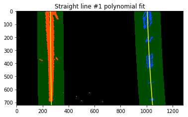
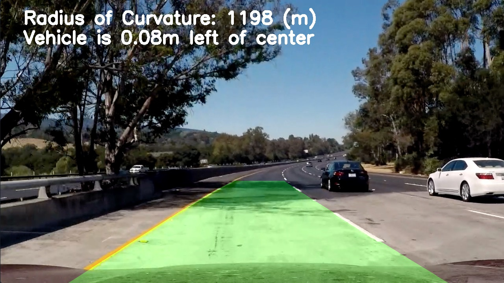

# Self-Driving Car Engineer Nanodegree


## Project: **Advanced Lane Finding** 
[](http://www.udacity.com/drive)


## Overview
---

**Advanced Lane Finding Project**

The main goal of this project is to use front-facing camera mounted in the car to detect lane lines in real-time, highlighting the lane the car is in, as well as providing lane curvature radius and the position of the vehicle in the lane.

The steps of the pipeline used this project are as follow:

1. Compute the camera calibration matrix and distortion coefficients given a set of chessboard images.
2. Apply a distortion correction to raw images.
3. Use color transforms, gradients, etc., to create a thresholded binary image.
4. Apply a perspective transform to rectify binary image ("birds-eye view").
5. Detect lane pixels and fit to find the lane boundary.
6. Determine the curvature of the lane and vehicle position with respect to center.
7. Warp the detected lane boundaries back onto the original image.
8. Output visual display of the lane boundaries and numerical estimation of lane curvature and vehicle position.
9. Putting all the above image processing steps together into a single a process_image function
10. Apply the process image function to video clip or stream

[//]: # (Image References)

[image1]: ./examples/undistort_output.png "Undistorted"
[image2]: ./test_images/test1.jpg "Road Transformed"
[image3]: ./examples/binary_combo_example.jpg "Binary Example"
[image4]: ./examples/warped_straight_lines.jpg "Warp Example"
[image5]: ./examples/color_fit_lines.jpg "Fit Visual"
[image6]: ./examples/example_output.jpg "Output"
[video1]: ./project_video.mp4 "Video"

---

# Setup

This project is programmed using Python 3 in Jupyter Notebook. Some common open source frameworks were used in this project:

* `openCV2`: Computer vision processing library
* `numpy`: Array and matrices manipulation
* `matplotlib`: Plot graphs or show images
* `glob`: Create list of files
* `pickle`: Save/load raw format workspace data
* `moviepy`: Access to read, edit and write to video


### Camera Calibration - WHY and HOW?

Before beginning any camera calibration, it is important to start off with a camera source as unbiased as possible. Due to the inevitable nature of any cameras, there will always be some distortions. The amount of distortion varies. 

The purpose of this function is to compute the camera calibration, which is a set of coefficients based on a sample pool of camera calibration images. These camera calibration images are in the format of 9x6 chessboard. Chessboard images were selected for calibration because it has a regular high contrast pattern, which makes it very easy for us to find corners upfront.

In order to calculate the camera calibration coefficients, we first need to identify a set of 2D image points and 3D object points for the corners. For the 2D image points, since we know it is a 9x6 chessboard, assuming the chessboard is fixed on the (x, y) plane at z=0, such that the object points are the same for each calibration image, we can define object points accordingly like one implemented below. For the 3D object points, we can use the `cv2.findChessboardCorners()`.

Once we have the image and object points, we can then use `cv2.calibrateCamera()` to finally compute the camera calibration coefficient. We will use these coefficient to undistort the disorted images straight from camera.

I applied this distortion correction to the test image using the `cv2.undistort()` function and obtained this result: 


```python
def map_obj_img_points(img_name, objpoints, imgpoints, visible=True, h_corners=9, v_corners=6):
    # Prepare object points, like (0,0,0), (1,0,0), (2,0,0) ....,(6,5,0)
    objp = np.zeros((9*6,3), np.float32)
    objp[:,:2] = np.mgrid[0:9,0:6].T.reshape(-1,2)

    img = cv2.imread(img_name)
    gray = cv2.cvtColor(img,cv2.COLOR_BGR2GRAY)

    # Find the chessboard corners
    ret, corners = cv2.findChessboardCorners(gray, (h_corners,v_corners),None)

    # If found, add object points, image points
    if ret == True:
        objpoints.append(objp)
        imgpoints.append(corners)
    else:
        print("Unable to detect corners for image : " + img_name )
    return objpoints, imgpoints

def compute_camera_calibration(calibration_images):
    # Arrays to store object points and image points from all the images.
    objpoints = [] # 3d points in real world space
    imgpoints = [] # 2d points in image plane
    
    # Make a list of calibration images
    images = glob.glob(calibration_images)
    
    # Step through the list and search for chessboard corners
    for fname in images:
        img = cv2.imread(fname)
        objpoints, imgpoints = map_obj_img_points(fname,objpoints,imgpoints,visible=False)

    img_size = (img.shape[1], img.shape[0])
    
    # Do camera calibration given object points and image points
    ret, mtx, dist, rvecs, tvecs = cv2.calibrateCamera(objpoints, imgpoints, img_size,None,None)
    return ret, mtx, dist, rvecs, tvecs

def undistort_camera_img(img,mtx,dist):   
    undist_img = cv2.undistort(img, mtx, dist, None, mtx)    
```

### Pipeline (single images)

#### 1. Distortion correcting image

After obtaining the camera calibration using `cv2.calibrateCamera()`, now I can apply distortion correction to other test images using `cv2.undistort()`, like one shown below.


#### 2. Thresholded binary image

In order to extract useful features from the image, it is common to use a combination thresholded binary image techniques. I used a combination of **color and gradient thresholds** filters to generate a single binary image. This way I can get as much information about the lane lines from the image as possible. 

For the color threshold binary image extraction, I chose to work in the **HLS color space** rather than the traditional RGB color space because the HLS color space can pick up **not only the white but also the yellow lines robustly** under various light changing conditions. It's worth noting, however, that the R (red) channel still does rather well on the white lines, perhaps even better than the S (saturation) channel. As with gradients, it's worth considering how you might combine various color thresholds to make the most robust identification of the lines.

This is an example of binary image using the saturation color filter on a test image using `saturation_thresh(img,s_thresh)`

```python
def saturation_thresh(img,s_thresh):
    # Convert to HLS color space and separate the S channel
    hls = cv2.cvtColor(img, cv2.COLOR_RGB2HLS)
    h_channel = hls[:,:,0]
    l_channel = hls[:,:,1]
    s_channel = hls[:,:,2]
    
    # Threshold saturation channel
    s_binary = np.zeros_like(s_channel)
    s_binary[(s_channel >= s_thresh[0]) & (s_channel <= s_thresh[1])] = 1

    return s_binary
```


Similarly, I used the directional gradient filter to extract the close to vertical feature in the test image using `abs_sobel_thresh(img, orient, sobel_kernel, thresh)` to obtain the gradient-directional binary image below.

```python
def abs_sobel_thresh(img, orient, sobel_kernel, thresh):
    # Calculate directional gradient
    # Apply threshold

    # 1) Convert to grayscale
    # 2) Take the derivative in x or y given orient = 'x' or 'y'
    # 3) Take the absolute value of the derivative or gradient
    # 4) Scale to 8-bit (0 - 255) then convert to type = np.uint8
    # 5) Create a mask of 1's where the scaled gradient magnitude 
            # is > thresh_min and < thresh_max
    # 6) Return this mask as your binary_output image
    
    gray = cv2.cvtColor(img,cv2.COLOR_RGB2GRAY)
    if (orient == 'x'):
        # Take the derivative in x
        sobel = cv2.Sobel(gray,cv2.CV_64F,1,0,ksize=sobel_kernel)
    elif (orient == 'y'):
        # Take the derivative in y
        sobel = cv2.Sobel(gray,cv2.CV_64F,0,1,ksize=sobel_kernel)
    
    abs_sobel = np.absolute(sobel)
    scaled_sobel = np.uint8(255*abs_sobel/np.max(abs_sobel))
    
    grad_binary = np.zeros_like(scaled_sobel)
    grad_binary[(scaled_sobel >= thresh[0]) & (scaled_sobel <= thresh[1])] = 1
    return grad_binary
```


To put the combined image binary extraction together, I can simply sum them up using `combine_binary_thresh(binary_1,binary_2)`. Below the binary image on the left highlights the two filters stacking one on top of another and the binary image on the right show the final combined binary image, which I use for the next pipeline for perspective transform it to an bird-eye view.

```python
def combine_binary_thresh(binary_1,binary_2):
    # Combine binary thresholds (saturation and directional gradient)
    combined_binary = np.zeros_like(binary_1)
    combined_binary[(binary_1 == 1) | (binary_2 == 1)] = 1
    
    return combined_binary
```


#### 3. Perspective Transform

Apply a perspective transform to rectify binary image ("birds-eye view"). Using the two straight lines images to verify that the perspective transform is correct. That is the lane lines in the images aligned with the overlayed vertical lines drawn as shown below.

```python
src = np.float32(
        [[245,  680],  # Bottom left
         [580,  460],  # Top left
         [710,  460],  # Top right
         [1060, 680]]) # Bottom right

dst = np.float32(
        [[245,  680],  # Bottom left
         [245,    0],  # Top left
         [1060,   0],  # Top right
         [1060, 680]]) # Bottom right
M = cv2.getPerspectiveTransform(src,dst)

def warp(img,M):
    img_size = (img.shape[1], img.shape[0])

    # Create warped image using linear interpolation
    warped_img = cv2.warpPerspective(img, M, img_size, flags=cv2.INTER_LINEAR)
    
    return warped_img
```

This resulted in the following source and destination points:

| Source        | Destination   | 
|:-------------:|:-------------:| 
| 245, 680      | 245, 680      | 
| 580, 460      | 245, 0        |
| 710, 460      | 1060, 0       |
| 1060, 680     | 1060, 680     |

I verified that my perspective transform was working as expected by drawing the `src` and `dst` points onto a test image and its warped counterpart to verify that the lines appear parallel in the warped image.


#### 4. Detect Lane Lines

The detection of the lane lines are broken into two steps:

    1. Use histogram to find left and right lanes
    2. Use 2nd order polynomial to fit the left and right lanes

#### 4.1 Find left and right lanes

To find the lane lines, I separated the lane line pixels search strategy with two approaches: sliding windows and centroid method. The sliding window method works well when there was no prior knowledge of the location of the lane lines, with this method it is more likely to find the lane pixels by scaning through the sliding window. A more efficient way to look for the lane lines (pixels) is to search the next sliding window **around the known location of the last detected lane lines** like one shown in `search_around_poly_lane_lines()`.

With the sliding window approach, I first took the bottom half of the image and located the **peaks of the left and right halves of the histogram** along the horziontal axis. These will be the starting point for the left and right lines.

The x index of the histogram peaks is used to specify the base location of our sliding windows where I looked for the lane lines. Then I created two lists to add only the non-zero pixels within the sliding windows for the left and right lanes.

If the number of the pixels found in the sliding window is greater than the minimum pixels specified in the window, recenter next window on their mean position. Continue the non-zero pixeld search until the last sliding windows.

```python
def get_histogram(img):
    # Grab only the bottom half of the image
    # Lane lines are likely to be mostly vertical nearest to the car
    bottom_half = img[img.shape[0]//2:,:] # floor division
    
    # Sum across image pixels vertically - make sure to set `axis`
    # i.e. the highest areas of vertical lines should be larger values
    # along all the columns in the lower half of the image
    # The image data. The returned array has shape (M, N) for grayscale images.
    histogram = np.sum(bottom_half, axis=0)
    
    return histogram
```

<table><tr><td></td><td></td></tr></table>

<table><tr><td></td><td></td></tr></table>

<table><tr><td></td><td></td></tr></table>
<table><tr><td></td><td></td></tr></table>


```python
def detect_lane_lines(img, lines_fit, bad_frames, output_img=False):
    # Initalize the lane line search for the first video frame / image
    if lines_fit is None:
        return full_search_lane_lines(img,bad_frames)
    else: 
        # Otherwise search the lane lines around the polynomial fit 
        # from the prior video frame
        return search_around_poly_lane_lines(img,lines_fit,bad_frames)
    
def full_search_lane_lines(img, bad_frames, output_img=False):
    show_search_window = True
        
    # Take a histogram of the bottom half of the image
    histogram = get_histogram(img)

    if output_img:
        # Create an output image to draw on and  visualize the result
        out_img = np.dstack((img, img, img))*255
    
    # Find the peak of the left and right halves of the histogram
    # These will be the starting point for the left and right lines
    midpoint = np.int(histogram.shape[0]//2)
    leftx_base = np.argmax(histogram[:midpoint])
    rightx_base = np.argmax(histogram[midpoint:]) + midpoint

    # Choose the number of sliding windows
    nwindows = 9
    
    # Set height of windows
    window_height = np.int(img.shape[0]//nwindows)
    
    # Identify the x and y positions of all nonzero pixels in the image
    nonzero  = img.nonzero()
    nonzerox = np.array(nonzero[1])   
    nonzeroy = np.array(nonzero[0])
   
    # Current positions to be updated for each window
    leftx_current = leftx_base
    rightx_current = rightx_base
    
    # Set the width of the windows +/- margin
    margin = 100

    # Set minimum number of pixels found to recenter window
    minpix = 50
    
    # Create empty lists to receive left and right lane pixel indices
    left_lane_inds = []
    right_lane_inds = []

    # Step through the windows one by one
    for window in range(nwindows):
        # Identify window boundaries in x and y (and right and left)
        win_y_low = img.shape[0] - (window + 1)*window_height
        win_y_high = img.shape[0] - window*window_height
        win_xleft_low = leftx_current - margin
        win_xleft_high = leftx_current + margin
        win_xright_low = rightx_current - margin
        win_xright_high = rightx_current + margin
        
        if output_img:
            #Draw the windows on the visualization image
            cv2.rectangle(out_img,(win_xleft_low,win_y_low),(win_xleft_high,win_y_high), (0,255,0), 3) 
            cv2.rectangle(out_img,(win_xright_low,win_y_low),(win_xright_high,win_y_high), (0,255,0), 3) 
        
        # Identify the nonzero pixels in x and y within the window
        good_left_inds = ((nonzeroy >= win_y_low) & (nonzeroy < win_y_high) & 
                          (nonzerox >= win_xleft_low) &  (nonzerox < win_xleft_high)).nonzero()[0]
        good_right_inds = ((nonzeroy >= win_y_low) & (nonzeroy < win_y_high) & 
                           (nonzerox >= win_xright_low) &  (nonzerox < win_xright_high)).nonzero()[0]
        
        # Append these indices to the lists
        left_lane_inds.append(good_left_inds)
        right_lane_inds.append(good_right_inds)
        
        # If you found > minpix pixels, recenter next window on their mean position
        if len(good_left_inds) > minpix:
            leftx_current = np.int(np.mean(nonzerox[good_left_inds]))
        if len(good_right_inds) > minpix:        
            rightx_current = np.int(np.mean(nonzerox[good_right_inds]))

    # Concatenate the arrays of indices
    left_lane_inds = np.concatenate(left_lane_inds)
    right_lane_inds = np.concatenate(right_lane_inds)
    
    # Extract left and right line pixel positions
    leftx = nonzerox[left_lane_inds]
    lefty = nonzeroy[left_lane_inds] 
    rightx = nonzerox[right_lane_inds]
    righty = nonzeroy[right_lane_inds] 
    
    lines_fit, ploty, left_fitx, right_fitx, xm_per_pix = fit_polynomial_pixel_space(img.shape,leftx,lefty,rightx,righty)
    
    if output_img:
        # Draw left and right pixels in colors
        out_img[nonzeroy[left_lane_inds], nonzerox[left_lane_inds]] = [255, 0, 0]
        out_img[nonzeroy[right_lane_inds], nonzerox[right_lane_inds]] = [0, 0, 255]
        
        # Draw the line fit for the left and right lane
        for index in range(img.shape[0]):
            cv2.circle(out_img, (int(left_fitx[index]), int(ploty[index])), 3, (255,255,0))
            cv2.circle(out_img, (int(right_fitx[index]), int(ploty[index])), 3, (255,255,0))

        if show_search_window:
            # Generate a polygon to illustrate the search window area
            # And recast the x and y points into usable format for cv2.fillPoly()
            left_line_window1 = np.array([np.transpose(np.vstack([left_fitx-margin, ploty]))])
            left_line_window2 = np.array([np.flipud(np.transpose(np.vstack([left_fitx+margin, 
                                      ploty])))])
            left_line_pts = np.hstack((left_line_window1, left_line_window2))
            right_line_window1 = np.array([np.transpose(np.vstack([right_fitx-margin, ploty]))])
            right_line_window2 = np.array([np.flipud(np.transpose(np.vstack([right_fitx+margin, 
                                      ploty])))])
            right_line_pts = np.hstack((right_line_window1, right_line_window2))

            # Draw the lane onto the warped blank image
            window_img = np.zeros_like(out_img)
            cv2.fillPoly(window_img, np.int_([left_line_pts]), (0,255, 0))
            cv2.fillPoly(window_img, np.int_([right_line_pts]), (0,255, 0))
            out_img = cv2.addWeighted(out_img, 1, window_img, 0.3, 0)
        return lines_fit, ploty, left_fitx, right_fitx, xm_per_pix, bad_frames,out_img.astype(int)
    return lines_fit, ploty, left_fitx, right_fitx, xm_per_pix, bad_frames

def search_around_poly_lane_lines(img, lines_fit, bad_frames, output_img=False):
    left_fit = lines_fit[0]
    right_fit = lines_fit[1]
    
    # HYPERPARAMETER
    # Choose the width of the margin around the previous polynomial to search
    margin = 100

    # Grab activated pixels
    nonzero = img.nonzero()
    nonzeroy = np.array(nonzero[0])
    nonzerox = np.array(nonzero[1])
    
    ### Set the area of search based on activated x-values ###
    ### within the +/- margin of our polynomial function ###
    left_lane_inds  = ((nonzerox > (left_fit[0]*(nonzeroy**2) + left_fit[1]*nonzeroy + left_fit[2] - margin))
                    &  (nonzerox < (left_fit[0]*(nonzeroy**2) + left_fit[1]*nonzeroy + left_fit[2] + margin)))
    right_lane_inds = ((nonzerox > (right_fit[0]*(nonzeroy**2) + right_fit[1]*nonzeroy + right_fit[2] - margin)) 
                    &  (nonzerox < (right_fit[0]*(nonzeroy**2) + right_fit[1]*nonzeroy + right_fit[2] + margin)))
    
    # Again, extract left and right line pixel positions
    leftx  = nonzerox[left_lane_inds]
    lefty  = nonzeroy[left_lane_inds] 
    rightx = nonzerox[right_lane_inds]
    righty = nonzeroy[right_lane_inds]
    
    # If the lines are lost for several frames in a row, retain the previous positions 
    # from the frame prior and step to the next frame to search again start searching from scratch
    # using a histogram and sliding window, 
    if (leftx.size == 0 or rightx.size == 0):
        # Increase bad frame counter when no left and right lane lane pixels are found
        bad_frames+=1
        
        if bad_frames < 5:    
            # Generate x and y values for plotting
            ploty = np.linspace(0, img_shape[0] - 1, img_shape[0])
            left_fitx  = lines_fit[0]
            right_fitx = lines_fit[1]

            # Calculate the actual bird eye view meters per pixels
            left_c = left_fit[0] * img_shape[0] ** 2 + left_fit[1] * img_shape[0] + left_fit[2]
            right_c = right_fit[0] * img_shape[0] ** 2 + right_fit[1] * img_shape[0] + right_fit[2]
            lane_width_pix = right_c - left_c
            xm_per_pix = 3.7 / lane_width_pix
            
            return lines_fit, ploty, left_fitx, right_fitx, xm_per_pix, bad_frames
        else:
            # Restart counting the bad frames and start a new search of the lane pixels
            bad_frames = 0 
            return full_search_lane_lines(img,bad_frames)
    
    # Fit new polynomials
    lines_fit, ploty, left_fitx, right_fitx, xm_per_pix = fit_polynomial_pixel_space(img.shape, leftx, lefty, rightx, righty)
    
    if output_img:
        ## Visualization ##
        # Create an image to draw on and an image to show the selection window
        out_img = np.dstack((img, img, img))*255
        window_img = np.zeros_like(out_img)
    
        # Color in left and right line pixels
        out_img[nonzeroy[left_lane_inds], nonzerox[left_lane_inds]] = [255, 0, 0]
        out_img[nonzeroy[right_lane_inds], nonzerox[right_lane_inds]] = [0, 0, 255]

        # Generate a polygon to illustrate the search window area
        # And recast the x and y points into usable format for cv2.fillPoly()
        left_line_window1 = np.array([np.transpose(np.vstack([left_fitx-margin, ploty]))])
        left_line_window2 = np.array([np.flipud(np.transpose(np.vstack([left_fitx+margin, 
                                  ploty])))])
        left_line_pts = np.hstack((left_line_window1, left_line_window2))
        right_line_window1 = np.array([np.transpose(np.vstack([right_fitx-margin, ploty]))])
        right_line_window2 = np.array([np.flipud(np.transpose(np.vstack([right_fitx+margin, 
                                  ploty])))])
        right_line_pts = np.hstack((right_line_window1, right_line_window2))

        # Draw the lane onto the warped blank image
        cv2.fillPoly(window_img, np.int_([left_line_pts]), (0,255, 0))
        cv2.fillPoly(window_img, np.int_([right_line_pts]), (0,255, 0))
        result = cv2.addWeighted(out_img, 1, window_img, 0.3, 0)

        # Plot the polynomial lines onto the image
        plt.plot(left_fitx, ploty, color='yellow')
        plt.plot(right_fitx, ploty, color='yellow')
        ## End visualization steps ##
        return lines_fit, ploty, left_fitx, right_fitx, xm_per_pix, bad_frames, out_img.astype(int)
    return lines_fit, ploty, left_fitx, right_fitx, xm_per_pix, bad_frames
```

#### 4.2 Fitting the lane lines using 2nd order polynomial

Once the lane line pixels were identified in the previous step, I used the `fit_polynomial_pixel_space(img_shape,left_fit,right_fit)` to find the line fit for each lane line. This 2nd order polynomial line-fit takes image size, the lists of lane line pixels as input argument and predicts the x position of the left and right lane line.

```python
def fit_polynomial_pixel_space(img_shape,leftx,lefty,rightx,righty):
    # Fit a second order polynomial to each
    left_fit = np.polyfit(lefty, leftx, 2)
    right_fit = np.polyfit(righty, rightx, 2)
    
    # Generate x and y values for plotting
    ploty = np.linspace(0, img_shape[0] - 1, img_shape[0])
    
    try:
        left_fitx = left_fit[0]*ploty**2 + left_fit[1]*ploty + left_fit[2]
        right_fitx = right_fit[0]*ploty**2 + right_fit[1]*ploty + right_fit[2]
    except TypeError:
        # Avoids an error if `left` and `right_fit` are still none or incorrect
        print('The function failed to fit a line!')
    
    return ploty, left_fitx, right_fitx

ploty, left_fitx, right_fitx = fit_polynomial_pixel_space(img.shape,left_fit,right_fit)
leftx = left_fitx
rightx = right_fitx

if output_img:
    # Draw left and right pixels in colors
    out_img[nonzeroy[left_lane_inds], nonzerox[left_lane_inds]] = [255, 0, 0]
    out_img[nonzeroy[right_lane_inds], nonzerox[right_lane_inds]] = [0, 0, 255]

    #Draw the windows on the visualization image
    #cv2.rectangle(out_img,(win_xleft_low,win_y_low),(win_xleft_high,win_y_high), (0,255,0), 3) 
    #cv2.rectangle(out_img,(win_xright_low,win_y_low),(win_xright_high,win_y_high), (0,255,0), 3) 

    # Generate a polygon to illustrate the search window area
    # And recast the x and y points into usable format for cv2.fillPoly()
    left_line_window1 = np.array([np.transpose(np.vstack([left_fitx-margin, ploty]))])
    left_line_window2 = np.array([np.flipud(np.transpose(np.vstack([left_fitx+margin, 
                              ploty])))])
    left_line_pts = np.hstack((left_line_window1, left_line_window2))
    right_line_window1 = np.array([np.transpose(np.vstack([right_fitx-margin, ploty]))])
    right_line_window2 = np.array([np.flipud(np.transpose(np.vstack([right_fitx+margin, 
                              ploty])))])
    right_line_pts = np.hstack((right_line_window1, right_line_window2))

    # Draw the lane onto the warped blank image
    window_img = np.zeros_like(out_img)
    cv2.fillPoly(window_img, np.int_([left_line_pts]), (0,255, 0))
    cv2.fillPoly(window_img, np.int_([right_line_pts]), (0,255, 0))
    out_img = cv2.addWeighted(out_img, 1, window_img, 0.3, 0)

    #Plot the polynomial lines onto the image
    plt.plot(left_fitx, ploty, color='yellow')
    plt.plot(right_fitx, ploty, color='yellow')

    return ploty, leftx, rightx, out_img.astype(int)
```

As a result of the lane detection, the predicted lane lines are drawn in yellow, see below.

<table><tr><td></td><td></td></tr></table>
<table><tr><td></td><td></td></tr></table>

#### 5. Determine the curvature of the lane and vehicle position with respect to center.

Before we can determine the lane curvature in meters, first we need to convert the x and y coordinates from pixels space to meters. This involves measuring how long and wide the section of lane is that we're projecting in our warped image. We could do this in detail by measuring out the physical lane in the field of view of the camera, I assumed that the lane is about 30 meters long and 3.7 meters wide. Alternatively I could have derived the conversion from pixel space to world space in my images, compare the images with U.S. regulations that require a minimum lane width of 12 feet or 3.7 meters, and the dashed lane lines are 10 feet or 3 meters long each.

My source camera image has 720 pixels in the y-dimension, bear in mind that the image was perspective-transformed, so I took some pixels off, say 700 pixels in the y-dimension. Therefore, to convert from pixels to real-world meter measurements, I used:

```python
# Define conversions in x and y from pixels space to meters
ym_per_pix = 30/720 # meters per pixel in y dimension
xm_per_pix = 3.7/700 # meters per pixel in x dimension
```

I defined a function `fit_polynomial_world_space(img_shape, leftx, rightx, ym_per_pix, xm_per_pix)` that takes the range of y pixels, the left and right lanes non-zero pixels and scaling of pixels to meters, and output the polynomial coefficients for lane and right lanes that predicts the x position in meters.

```python
def fit_polynomial_world_space(ploty, leftx, rightx, ym_per_pix, xm_per_pix):
    leftx = leftx[::-1]    # Reverse to match top-to-bottom in y
    rightx = rightx[::-1]  # Reverse to match top-to-bottom in y
    
    try:        
        # Fit polynomials to x,y in world space
        left_fit_cr  = np.polyfit(ploty*ym_per_pix, leftx*xm_per_pix, 2)
        right_fit_cr = np.polyfit(ploty*ym_per_pix, rightx*xm_per_pix, 2)
        
    except TypeError:
        # Avoids an error if `left` and `right_fit` are still none or incorrect
        print('The function failed to fit a line!')
    
    # Second-order polynomial to predict y position
    # f(y) = Ay^2 + By + Cf(y)
    left_A_coeff = left_fit_cr[0]
    left_B_coeff = left_fit_cr[1]
    left_C_coeff = left_fit_cr[2] # not used for prediction
    
    right_A_coeff = right_fit_cr[0]
    right_B_coeff = right_fit_cr[1]
    right_C_coeff = right_fit_cr[2] # not used for prediction
    
    return left_A_coeff, left_B_coeff, right_A_coeff, right_B_coeff
```

To calculate the radius of lane curvature, simply use the radius of curvature formula, which implemented in the `compute_curvature(img_shape, leftx, rightx, ym_per_pix, xm_per_pix)`


```python
def compute_curvature(img_shape, leftx, rightx, ym_per_pix, xm_per_pix):
    ploty = np.linspace(0, img_shape[0]-1, img_shape[0]) # to cover same y-range as image
    
    # Polynomial line fit in meters (not pixel space any more)
    left_A_coeff, left_B_coeff, right_A_coeff, right_B_coeff = fit_polynomial_world_space(ploty, leftx, rightx, ym_per_pix, xm_per_pix)
    
    # Define y-value where we want radius of curvature
    # Choose the maximum y-value, corresponding to the bottom of the image
    y_eval = np.max(ploty)*ym_per_pix
    
    # Calculation of R_curve (radius of curvature)
    left_curverad = ((1 + (2*left_A_coeff*y_eval + left_B_coeff)**2)**1.5) / np.absolute(2*left_A_coeff)
    right_curverad = ((1 + (2*right_A_coeff*y_eval + right_B_coeff)**2)**1.5) / np.absolute(2*right_A_coeff)
    
    # Estimated lane curvature
    radius_of_curvature = (left_curverad + right_curverad)/2
    
    # The radius of curvature in meters for both lane lines
    return radius_of_curvature, left_curverad, right_curverad
```

Vehicle offset

Assuming the camera is mounted at the center of the car, such that the lane center is the midpoint at the bottom of the image between the two lines you've detected. The offset of the lane center from the center of the image (converted from pixels to meters) is your distance from the center of the lane.

To cacluate the vehicle offset, calculate the x position between the left and right lane and measure the postion relative to the mid point of the image, then scale it with the x-pixel to meters conversion.

```python
def compute_veh_offset(img_shape, leftx, rightx, xm_per_pix):
    midpointx = img_shape[1]//2
        
    # Vehicle position with respect to the lane
    # Lane center is the midpoint at the bottom of the image between the two lines detected.
    veh_posx = (leftx[-1] + rightx[-1])/2
    
    # Horizontal offset 
    veh_offsetx = (midpointx - veh_posx) * xm_per_pix

    return veh_offsetx
```

###  6. Warp the Detected Lane Boundary and display of the lane boundaries
Warp the detected lane boundaries back onto plotted back down onto the road image. I implemented this step using `draw_line()`. Here is an example of my result on a test image:

```python
def draw_lane(img,combined_warped,Minv,ploty,left_fitx,right_fitx):
           
    # Create an image to draw the lines on
    warp_zero = np.zeros_like(combined_warped).astype(np.uint8)
    color_warp = np.dstack((warp_zero, warp_zero, warp_zero))
    
    # Recast the x and y points into usable format for cv2.fillPoly()
    pts_left = np.array([np.transpose(np.vstack([left_fitx, ploty]))])
    pts_right = np.array([np.flipud(np.transpose(np.vstack([right_fitx, ploty])))])
    pts = np.hstack((pts_left, pts_right))

    # Draw the lane onto the warped blank image
    cv2.fillPoly(color_warp, np.int_([pts]), (0,255, 0))

    # Warp the blank back to original image space using inverse perspective matrix (Minv)
    new_warp = cv2.warpPerspective(color_warp, Minv, (img.shape[1], img.shape[0]))
    
    # Combine the result with the original image
    out_img = cv2.addWeighted(img, 1, new_warp, 0.3, 0)

    return out_img
```

<table><tr><td></td><td></td></tr></table>
<table><tr><td></td><td></td></tr></table>
<table><tr><td></td><td></td></tr></table>
<table><tr><td></td><td></td></tr></table>


### 7. Display estimation of lane curvature and vehicle position

At the last step of the pipeline, I overlayed the results obtained from the `compute_curvature()` and `compute_veh_offset` to the image.

```python
def display_estimation(img, radius_of_curvature, veh_offsetx):

    # Display lane curvature
    out_img = img.copy()
    cv2.putText(out_img, 'Radius of Curvature: {:.0f} (m)'.format(radius_of_curvature), 
                (60, 60), cv2.FONT_HERSHEY_SIMPLEX, 1.5, (255,255,255), 5)
    
    # Display vehicle offset
    if veh_offsetx < 0.0: 
        cv2.putText(out_img, 'Vehicle is {:.2f}m left of center'.format(np.absolute(veh_offsetx)), 
                    (60, 110), cv2.FONT_HERSHEY_SIMPLEX, 1.5, (255,255,255), 5)
    else:
        cv2.putText(out_img, 'Vehicle is {:.2f}m right of center'.format(veh_offsetx), 
                    (60, 110), cv2.FONT_HERSHEY_SIMPLEX, 1.5, (255,255,255), 5)
    
    return out_img
```


---

### Pipeline (Image)

```python
# Define a class to receive the characteristics of each line detection
class Line:
    # Initalize the class
    def __init__(self, images,always_on_calibrate=True):
        # Define conversions in x and y from pixels space to meters
        self.ym_per_pix = 30/720 # meters per pixel in y dimension
        self.xm_per_pix = 3.7/700 # meters per pixel in x dimension

        if always_on_calibrate:
            # Calibrate camera
            self.ret, self.mtx, self.dist, self.rvecs, self.tvecs = compute_camera_calibration(images)
            
            # Optional save the camera calibration as pickle file
            save_camera_calibration(self.ret, self.mtx, self.dist, self.rvecs, self.tvecs)
        else:
            # Load previous camera calibration
            self.ret, self.mtx, self.dist, self.rvecs, self.tvecs = \
            load_camera_calibration(camera_calibration='camera_cal/camera_cal.p')
        
        # Binary image thresholds
        self.orient = 'x'
        self.sobel_kernel = 3
        self.sx_thresh = [20, 100]
        self.s_thresh = [170, 255]

        # Pick 4 points to transform
        # Note: src and dst points are in [x,y] format
        self.src = np.float32(
        [[245,  680],  # Bottom left
         [580,  460],  # Top left
         [710,  460],  # Top right
         [1060, 680]]) # Bottom right

        self.dst = np.float32(
        [[245,  680],  # Bottom left
         [245,    0],  # Top left
         [1060,   0],  # Top right
         [1060, 680]]) # Bottom right
    
        # The perspective transform matrices
        self.M = cv2.getPerspectiveTransform(self.src, self.dst)
        self.Minv = cv2.getPerspectiveTransform(self.dst, self.src)
        
        self.lines_fit = None
        
        # was the line detected in the last iteration?
        self.detected = False  
        
        # x values of the last n fits of the line
        self.recent_xfitted = []
        
        #x values for detected line pixels
        #self.allx = None  
        
        #y values for detected line pixels
        #self.ally = None
        
        self.ploty = None
        self.leftx = None
        self.rightx = None
        
        #average x values of the fitted line over the last n iterations
        self.bestx = None   
        
        #polynomial coefficients averaged over the last n iterations
        self.best_fit = None
        
        #polynomial coefficients for the most recent fit
        self.current_fit = [np.array([False])]  
        
        #radius of curvature of the line in some units
        self.radius_of_curvature = None 
        
        #distance in meters of vehicle center from the line
        self.line_base_pos = None 
        
        #difference in fit coefficients between last and new fits
        self.diffs = np.array([0,0,0], dtype='float') 
        
    # This is a special function active during the life time of the execution    
    def __call__(self, img):
        
        # Apply the image processing to the source image
        out_img = self.pipeline(img)
        return out_img
    
    def pipeline(self,img):
        # 1. Calibrate camera (see init method)
        
        # 2. Undistort the image
        undist_img = undistort_camera_img(img,mtx=self.mtx,dist=self.dist)
        out_img = undist_img
        #plot_images(img,undist_img,title1='Camera Image',title2='Undistorted Image')
        
        # 3. Threholding binary images
        # Create gradient-directional threshold binary image
        sx_binary = abs_sobel_thresh(undist_img,self.orient,self.sobel_kernel,self.sx_thresh)
        #plot_images(undist_img,sx_binary,title1='Undisorted Camera Image',title2='Gradient-directional binary')
        
        # Create saturation threshold binary image
        s_binary = saturation_thresh(undist_img,self.s_thresh)
        #plot_images(undist_img,s_binary,title1='Undisorted Camera Image',title2='Saturation binary')
        
        # Stacked binary
        color_binary = np.dstack((np.zeros_like(sx_binary), sx_binary, s_binary)) * 255
        # Combined binary
        combined_binary = combine_binary_thresh(sx_binary,s_binary)
        #plot_images(color_binary,combined_binary,title1='Stacked binary',title2='Combined binary')
        
        # 4. Perspective Transform
        warped_img = warp(undist_img,self.M)
        #plot_images(undist_img,warped_img,title1=None,title2=None)
        combined_warped = warp(combined_binary,self.M)
        #plot_images(warped_img,combined_warped,title1='Bird-eye view',title2='Bird-eye view binary')
        
        # 5. Detect lane lines
        self.ploty, self.leftx, self.rightx = detect_lane_lines(combined_warped)
        # Disable the output image for the detect_lane_lines to save computation
        #self.ploty, self.leftx, self.rightx, out_img = detect_lane_lines(combined_warped, output_img=True)
        
        # 6a. Calculate lane curvature
        self.radius_of_curvature, self.left_curvature, self.right_curvature = \
            compute_curvature(combined_warped.shape, self.leftx, self.rightx,\
                                          self.ym_per_pix, self.xm_per_pix)

        # 6b. Calculate the vehicle offset relative to the lane center
        self.line_base_pos = compute_veh_offset(img.shape, self.leftx, self.rightx, self.xm_per_pix)
        
        # 7. Draw lane lines on the image
        lane_img = draw_lane(img,combined_warped,self.Minv,self.ploty,self.leftx,self.rightx)
        out_img = lane_img
              
        # 8. Display the lane curvature and vehicle offset (to the lane)
        out_img = display_estimation(lane_img, self.radius_of_curvature, self.line_base_pos)
        
        # Free text overlay the image
        out_img = display(out_img,'')
        
        return out_img
```

<table><tr><td></td><td></td></tr></table>
<table><tr><td></td><td></td></tr></table>
<table><tr><td></td><td></td></tr></table>

### Pipeline (video)

<p align="center">
  <a href="output_videos/project_video.mp4"></a>
  <a href="output_videos/project_video.mp4">Link to my video result</a>
</p>

```python
input_video = 'test_videos/project_video.mp4'
output_video = 'output_videos/output_project_video.mp4'

preprocess_clip = VideoFileClip(input_video)
# preprocess_clip = VideoFileClip(input_video).subclip(0,5.0) #or subclip with the first 5 seconds

# Create a new 'Line' object
camera_cal_imgs = 'camera_cal/calibration*.jpg'
process_image = Line(camera_cal_imgs)

# Process video frames with the 'process_image' function
postprocess_clip = preprocess_clip.fl_image(process_image)

# Write the output video to the output_video file
%time postprocess_clip.write_videofile(output_video, audio=False)

```

---

### Discussion on pipeline

#### Problems / issues  in the current implementation of this project, potential solution and future work

Currently the lane detection pipeline is implemented with the minimum algorithm possible for basic lane detection like one shown with the `project_video`. In summary of the pipeline, the camera image is first undistorted then it goes through a series of threshold filters to extract useful lane lines features to a binary image. This extracted binary image is then transformed to a bird-eye view. After that a simple algorithm is used to find the location of high density yellow and white pixels (recognized as lane lines) in a number of sliding window. The sliding window is used to remember the last lane position if the minimum number of pixels are not found in the next sliding window (i.e. bad frame or broken lane lines).

After the raw lane lines are detected, I then used a 2nd-order polynomial to fit in the line curve. In other words to predict the lane curve for the next video frame, this is useful particularly if there are bad frames or lines are not seem over a certain time horizon timeframe.

After the pixel space polynomial is obtained, I re-scaled the polynomial to work in the world space (in meters not pixel). Using this new polynomial, I estimatd the radius of curvature and the vehicle offset to the lane.

At last, I drew the detected lane lines using the pixel space polynomial and project it back to the lane line using inverse perspective transform, so I used the perspective tranform with the "inverse" M matrix instead. Also overlay the estimated road curvature.

While the current lane detection pipeline works in certain conditions, more work needs to be done to improve the pipeline to make it work more robustly in more operating conditions. There are couple of weakest links in the current pipeline implementation. For example, it is not effective in reseting when it encounters no line or bad frames, rejection to shadows, other lane markings and nearby vehicles.

#### Not real-time ready yet
The pipeline takes about 2 minutes to process a 50 sec video clip, which could pose issue if we are taking this processing pipeline to use it in real-time. One way to reduce the computation is to remember the last search sliding window, this will greatly reduce the needs to blindly search the sliding windows for each sliding window.

#### Reset Mechanism
Currently my pipeline is a simple implementation, it does not have reset mechanism if there are bad or difficult frame of video, I can make it more robust by retain the previous positions from the frame prior and step to the next frame to search again. If I lose the lines for several frames in a row, I should probably start searching from scratch using a histogram and sliding window, or another method, to re-establish your measurement.

#### Smoothing
Despite my pipeline currently works well in the simple lighting conditions with good lane lines marking, currently my line detections will jump around from frame to frame a bit. To make the lane detection pipeline smoother, I can**smooth over the last n frames of video** to obtain a cleaner result. Each time I get a new high-confidence measurement, I can append it to the list of recent measurements and then **take an average over n past measurements** to obtain the lane position you want to draw onto the image.

#### Selection of hyper parameters requires lots of tuning (i.e. minimum pixels to recognize lane lines, the number of vertical sliding windows, windows margin, etc).
The selection of the hyper parameters to tune to detect the lane lines can be tricky to make it just "right" to give just sensitive enough to detect any lane lines but strong enough to reject the road noises. For example, if a minimum pixels to recognize is too small, the detection of the lane lines will be very poor hence greatly affects the reliability of the road curvature radius.

### Discussion on challenges to make the lane detection work robustly

In the `challenge_video`, the current algorithm will give unreliable road curvature and the vehicle offset most of the time when there is ...

| External Enivronment                     | Potential solution for better robustness   | 
|:----------------------------------------:|:------------------------------------------:| 
| Shadow of the curb or bridge             | Tune threshold binary to reject non yellow and white pixels | 
| Dual colors in pavement in the lane      | Tune threshold binary to reject non yellow and white pixels |
| (Dark gray) oil drip on the road         | Tune threshold binary to reject non yellow and white pixels |
| Other road markings in the lane          | Tune threshold binary to reject horzontal lines             |
| Horziontal lines on the road             | Tune threshold binary to reject horzontal lines             |
| A nearby car gets very close to the lane | Tune min pixels to recognize lane lines, skip window search for bad frame|


In the `harder_challenge_video`, the current algorithm will give unreliable road curvature and the vehicle offset  most of the time when there is ...


| External Enivronment                     | Potential solution for better robustness   | 
|:----------------------------------------:|:------------------------------------------:| 
| Motorist changing into your lane         | Reset and smoothing over the last n windows                 |
| Reflection of the dashboard to wind sceen| Tune threshold binary to reject close to horizontal lines   |
| Bright road curbs                        | Tune threshold binary to reject non yellow and white pixels | 
| Patches of tree shadows on the road      | Tune threshold binary to reject non yellow and white pixels | 
| Windsheild/camera cleaningness           | Tune threshold binary to reject non yellow and white pixels |
| Sun glare                                | Tune threshold binary to reject non yellow and white pixels | 
| Sharp turn                               | Reset and smoothing over the last n windows                 | 
| Oncoming traffic with/without headlight  | TBD                                                         |
| Double lane lines                        | TBD                                                         |

Other potential problems that are not found in the challenge videos.

| External Enivronment                     | Potential solution for better robustness   | 
|:----------------------------------------:|:------------------------------------------:| 
| Wet roads (reflection on the road)       | TBD | 
| Close to a car in front                  | TBD |
| White or yellow motorist in the lane     | TBD | 
| Night                                    | TBD | 
| Snow                                     | TBD | 
| Rainy                                    | TBD | 

